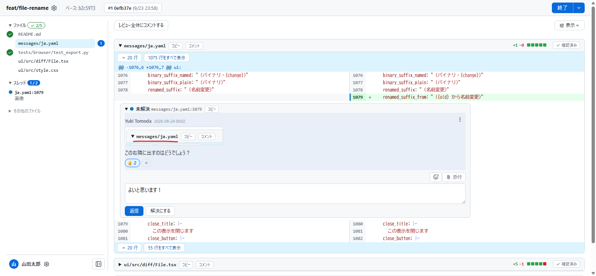

# diffnote

ローカル上でソースコードを外部に送信することなく、 GitHub や GitLab などに近いレビューが行えるツールです。

特定の行範囲にコメントをしたり、コメントに返信したりすることができます。

## スクリーンショット



## インストール

diffnote はシングルバイナリです。 GitHub の Releases から、使っている環境の実行ファイルを取ってきて、パスの通った場所に置いてください。

## 使い方

### レビューする人

```sh
cd your-repository
# main ブランチを基準に
diffnote init main
# 現在のHEADまでをレビュー
diffnote review
```

`main` から現在チェックアウトしているブランチまでの変更がブラウザで開きます。レビューを実施し終わったら、右上の「終了」ボタンを押して内容を確定し、作成された `.diffnote` ファイルを相手に渡してください。

もし相手が diffnote をインストールしていない場合は、左上のタイトルを押して、「エクスポート」ボタンでHTMLファイルとしてエクスポートできます（エクスポートの場合、返信等はできません）。

### レビューされる人

相手から受けとった `.diffnote` をリポジトリに置いて、

```sh
cd your-repository
diffnote open
```

レビュー対象として保存されていないファイルは閲覧できなくなりますが、リポジトリにない場合でも開けます。

```sh
# .diffnote ファイルを置いているとき
diffnote open

# 別の名前のとき
diffnote open -f some-review.diffnote
```

コメントを読んで、返信等ができます。修正のコミットを足してから開くと、その変更も一緒にレビューできます。
