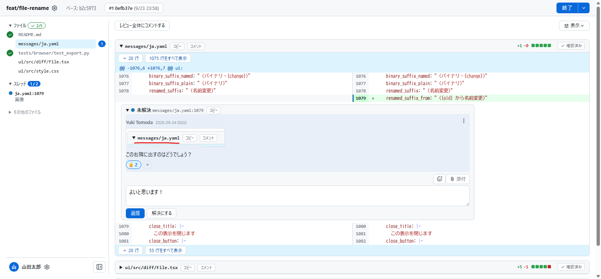

# diffnote

ローカル上でソースコードを外部に送信することなく、 GitHub や GitLab などに近いレビューが行えるツールです。

特定の行範囲にコメントをしたり、コメントに返信したりすることができます。

## スクリーンショット



## インストール

diffnote はシングルバイナリです。 GitHub の Releases から、使っている環境の実行ファイルを取ってきて、パスの通った場所に置いてください。

## 使い方

### レビューする人

```sh
cd your-repository
diffnote review
```

ブラウザが開き、最初はレビューの作り方を聞かれます。基準にするコミット(既定は、今のブランチが `main` から分かれたところ)を選んで「レビューを作る」を押すと、そこから現在の HEAD までの変更がレビューできます。次からは `diffnote review` だけで、新しいコミットも取り込まれます。

画面を開かずに作るなら `diffnote review --base main` のように基準を指定してください。複数の git リポジトリがあるディレクトリで実行すると、まとめて 1 つのレビューになります。

レビューを実施し終わったら、右上の「終了」ボタンを押して内容を確定し、作成された `.diffnote` ファイルを相手に渡してください。

もし相手が diffnote をインストールしていない場合は、左上のタイトルを押して、「エクスポート」ボタンでHTMLファイルとしてエクスポートできます（エクスポートの場合、返信等はできません）。

### レビューされる人

相手から受けとった `.diffnote` をリポジトリに置いて、

```sh
cd your-repository
diffnote open
```

レビュー対象として保存されていないファイルは閲覧できなくなりますが、リポジトリにない場合でも開けます。

```sh
# .diffnote ファイルを置いているとき
diffnote open

# 別の名前のとき
diffnote open -f some-review.diffnote
```

コメントを読んで、返信等ができます。修正のコミットを足してから `diffnote review` で開くと、その変更も一緒にレビューできます。
